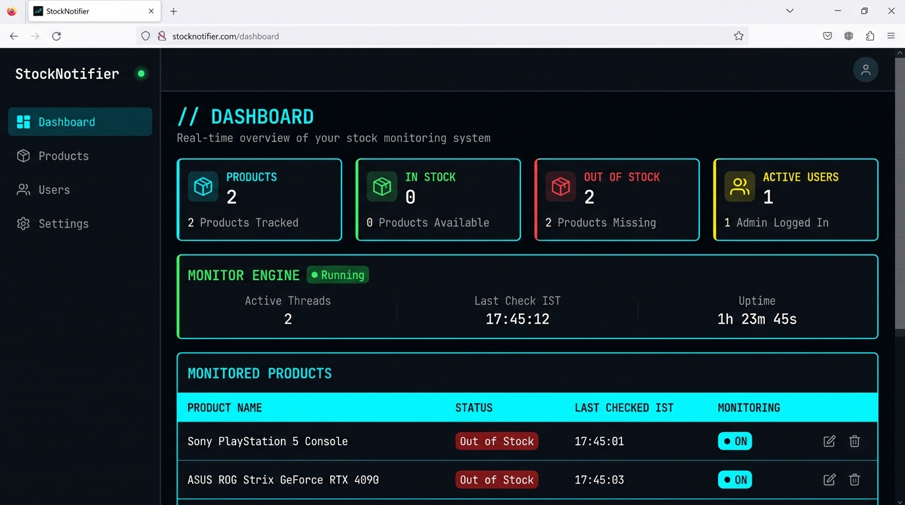
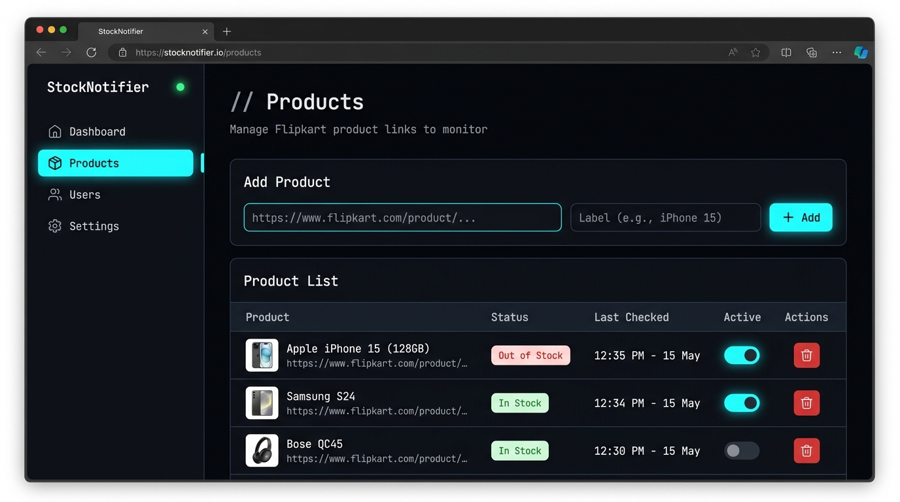
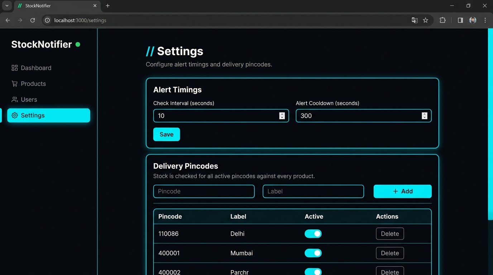

<div align="center">

# 📡 Flipkart Stock Notifier

**Real-time Flipkart stock monitoring with a tech-themed web dashboard and Telegram alerts.**

[](https://python.org)
[](https://flask.palletsprojects.com)
[](https://core.telegram.org/bots)
[](LICENSE)

Monitor Flipkart product pages for stock availability across multiple pincodes.  
Get instant Telegram alerts when items come back in stock — with pricing info.

</div>

---

## ✨ Features

| Feature | Description |
|---------|-------------|
| 🖥️ **Web Dashboard** | Dark, tech-themed responsive UI with real-time status cards, engine health monitoring, and live product tracking |
| 📦 **Product Management** | Add/remove/toggle Flipkart product links with URL validation |
| 📍 **Multi-Pincode** | Global pincode list — every product is checked against all active pincodes simultaneously |
| 👤 **User Management** | Add Telegram users manually or let them self-register via `/start` |
| 🤖 **Telegram Bot** | `/start` (register), `/status` (view products), `/add <url>` (add product from Telegram) |
| ⚙️ **Configurable Timings** | Adjust check interval and alert cooldown from the web UI — no restart needed |
| 🔄 **Hot Reload** | Adding/toggling products or changing settings takes effect immediately |
| 💾 **SQLite Database** | Persistent storage for products, users, pincodes, and settings |
| 📊 **Engine Health** | Dashboard shows active threads, last check time (IST), and uptime |
| 📱 **Fully Responsive** | Works on desktop, tablet, and mobile with collapsible sidebar navigation |

---

## 📸 Screenshots

### Dashboard
> Real-time overview with stat cards, engine health panel, and product status table.



### Products
> Add Flipkart URLs with validation, toggle monitoring per product, and track stock status.



### Settings
> Configure check intervals, alert cooldowns, and manage delivery pincodes.



---

## 🚀 Quick Start

### Prerequisites

- **Python 3.10+**
- A **Telegram Bot Token** (get one from [@BotFather](https://t.me/BotFather))

### 1. Clone the repository

```bash
git clone https://github.com/chetankaul/flipkart-stock-alert.git
cd flipkart-stock-alert
```

### 2. Install dependencies

```bash
pip install -r requirements.txt
```

### 3. Configure environment

Edit the `.env` file with your settings:

```env
TELEGRAM_BOT_TOKEN=your-bot-token-here
SECRET_KEY=change-me-to-something-random
CHECK_INTERVAL=10
ALERT_COOLDOWN=300
DEFAULT_PINCODE=110086
```

### 4. Run

```bash
python app.py
```

Open **http://127.0.0.1:5000** in your browser.

---

## 🏗️ Architecture

```
python app.py
    │
    ├── Flask Web UI ─────────── http://127.0.0.1:5000
    │     ├── /              Dashboard (stats + engine health + product status)
    │     ├── /products      Add / toggle / delete product links
    │     ├── /users         Manage Telegram alert recipients
    │     └── /settings      Check interval, cooldown, pincode management
    │
    ├── MonitorEngine ────────── Background daemon threads
    │     └── 1 thread per active product × all active pincodes
    │
    └── Telegram Bot ─────────── Polling thread
          ├── /start         Self-register for stock alerts
          ├── /status        View all monitored products
          └── /add <url>     Add a product directly from Telegram
```

---

## 📁 Project Structure

```
flipkart-stock-notifier/
├── app.py                  # Flask app factory + entry point
├── config.py               # Centralised .env config loader
├── models.py               # SQLAlchemy models (Product, User, Pincode, Setting)
├── monitor.py              # Background stock-checking engine
├── telegram_bot.py         # Telegram bot (registration, commands)
├── routes/
│   ├── products.py         # Product CRUD routes
│   ├── users.py            # User CRUD routes
│   └── settings.py         # Settings + pincode routes
├── templates/
│   ├── base.html           # Dark tech-themed base layout
│   ├── dashboard.html      # Dashboard with stats + health
│   ├── products.html       # Product management page
│   ├── users.html          # User management page
│   └── settings.html       # Settings + pincodes page
├── static/
│   └── style.css           # Tech-themed CSS (dark mode, neon accents)
├── screenshots/            # UI screenshots for README
├── .env                    # Environment config (git-ignored)
├── .gitignore
├── requirements.txt
├── LICENSE
└── README.md
```

---

## 🤖 Telegram Bot Commands

| Command | Description |
|---------|-------------|
| `/start` | Register yourself to receive stock alerts |
| `/status` | View all currently monitored products with status indicators |
| `/add <url>` | Add a Flipkart product URL to monitor |

Users are **auto-approved** on `/start` — no admin action needed.

---

## ⚙️ Configuration

All settings are stored in `.env` and can be overridden at runtime through the web UI:

| Variable | Default | Description |
|----------|---------|-------------|
| `TELEGRAM_BOT_TOKEN` | — | Your Telegram bot token from @BotFather |
| `SECRET_KEY` | `dev-secret-key` | Flask secret key for session security |
| `CHECK_INTERVAL` | `10` | Seconds between stock checks (when out of stock) |
| `ALERT_COOLDOWN` | `300` | Seconds to wait after an in-stock alert before re-checking |
| `DEFAULT_PINCODE` | `110086` | Default pincode seeded on first run |

---

## 🔧 How It Works

1. **Product Added** → A new daemon thread is spawned for that product
2. **Check Loop** → The thread hits Flipkart's internal API for each active pincode
3. **In Stock?** → Sends an HTML-formatted Telegram alert to all active users with:
   - Product name
   - Pincodes where available
   - Listing price & offer price
   - Direct product link
4. **Cooldown** → Waits `ALERT_COOLDOWN` seconds before checking again
5. **Out of Stock?** → Waits `CHECK_INTERVAL` seconds and retries

---

## 🛡️ Tech Stack

| Component | Technology |
|-----------|-----------|
| Backend | Python 3.10+, Flask 3.0 |
| Database | SQLite via Flask-SQLAlchemy |
| Telegram | pyTelegramBotAPI |
| Frontend | Jinja2, Vanilla CSS (no JS frameworks) |
| Config | python-dotenv |

---

## 📋 Roadmap

- [ ] Email alerts as an alternative to Telegram
- [ ] Price history tracking and charts
- [ ] Support for Amazon / other e-commerce platforms
- [ ] Docker container support
- [ ] Webhook mode for Telegram (instead of polling)
- [ ] REST API for external integrations

---

## 🤝 Contributing

Contributions are welcome! Feel free to:

1. Fork the repository
2. Create a feature branch (`git checkout -b feature/amazing-feature`)
3. Commit your changes (`git commit -m 'Add amazing feature'`)
4. Push to the branch (`git push origin feature/amazing-feature`)
5. Open a Pull Request

---

## 📄 License

This project is licensed under the MIT License — see the [LICENSE](LICENSE) file for details.

---

<div align="center">

**Built with ❤️ for deal hunters who never miss a restock.**

⭐ Star this repo if you found it useful!

</div>

